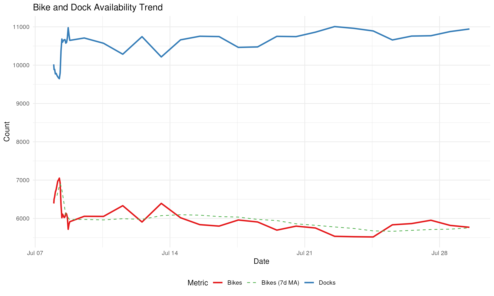

# 🚲 Toronto Bike Share Analytics

Updated: 2025-07-08 10:08 (Toronto Time)

## 📊 System Overview
| Metric | Value | Change |
|--------|-------|--------|
| **Total bikes available** | 6,112 | +94 |
| **Total docks available** | 10,600 | -81 |
| **System utilization rate** | 36.6% | +0.5% |
| **Active stations** | 921/921 (100%) |  |
| **Average bikes per station** | 6.6 | +0 |
| **Median station capacity** | 19 | - |
| **Empty stations** | 154 (16.7%) | -6 |
| **Full stations** | 50 (5.4%) | +9 |

## 🏆 Top 10 Stations by Bike Availability
| Station | Bikes Available | Capacity |
|---------|-----------------|----------|
| York St / Queens Quay W | 54 | 57 |
| Wellington St W / Bay St | 48 | 55 |
| Front St W / Yonge St (Hockey Hall of Fame) | 45 | 47 |
| Bremner Blvd / Rees St | 43 | 49 |
| Queens Quay / Yonge St | 41 | 46 |
| Bay St / Albert St | 38 | 63 |
| King St W / University Ave | 38 | 38 |
| Temperance St Station | 36 | 55 |
| Bay St / Queens Quay W (Ferry Terminal) | 34 | 35 |
| 265 Armadale Ave | 34 | 44 |

## 🏆 Top 10 Stations by Dock Availability
| Station | Docks Available | Capacity |
|---------|-----------------|----------|
| Humber Bay Shores Park / Marine Parade Dr | 57 | 63 |
| 439 Sherbourne St | 47 | 47 |
| Dundas St W / Crawford St | 43 | 47 |
| Hanlan's Point Beach | 43 | 47 |
| Fort York  Blvd / Capreol Ct | 40 | 47 |
| Bloor St W / Manning Ave - SMART | 40 | 42 |
| 144 Harrison St | 40 | 51 |
| Dundonald St / Church St | 38 | 39 |
| Brimley Rd / Lawrence Ave E  | 36 | 39 |
| Bathurst St / Front St W | 35 | 35 |

## 📊 Station Status Distribution
| Status     | Number of Stations |
|------------|-------------------:|
| Empty      | 154 |
| Full       | 50 |
| Available  | 717 |

## 📍 Bike Locations

## 📊 Station Status Distribution

## 📈 Bike Availability Distribution

## 📈 Historical Trends
### Bike and Dock Availability

### System Utilization Rate

## 📊 Sampling Methodology
The data is collected from the Toronto Bike Share GBFS API at a single point in time. This provides a snapshot of the system but may not capture temporal variations.

### Key Metrics Explained
1. **Utilization Rate**: The proportion of total bike slots that are occupied by bikes:
   $$\text{Utilization Rate} = \frac{\text{Total Bikes}}{\text{Total Bikes} + \text{Total Docks}} \times 100\%$$

2. **Station Status Classification**:
   - **Empty**: $\text{bikes} = 0$
   - **Full**: $\text{docks} = 0$
   - **Available**: $\text{bikes} > 0$ and $\text{docks} > 0$

### Statistical Notes
- The distribution of bikes across stations follows a right-skewed distribution
- The mean availability is 32.8% with a standard deviation of 29.8%
- The system is currently operating at 37% capacity

## ℹ️ Data Source
Data is sourced from the [Toronto Bike Share GBFS API](https://tor.publicbikesystem.net/ube/gbfs/v1/en/station_status)
